<p align="center">
  
</p>

<p align="center">
  <a href="https://github.com/keenanlaws/PyVswitch/releases/latest"></a>
  <a href="https://github.com/keenanlaws/PyVswitch/actions/workflows/ci.yml"></a>
  
  
  <a href="LICENSE"></a>
</p>

<p align="center">
  <b><a href="https://github.com/keenanlaws/PyVswitch/releases/latest">Download</a></b>
  &nbsp;·&nbsp; <a href="#what-it-does">Features</a>
  &nbsp;·&nbsp; <a href="#the-command-line">CLI</a>
  &nbsp;·&nbsp; <a href="#built-for-ai-assistants">AI &amp; MCP</a>
  &nbsp;·&nbsp; <a href="#how-a-switch-works">How it works</a>
  &nbsp;·&nbsp; <a href="#build-from-source">Build</a>
</p>

---

**pyvswitch** is a Python version manager for Windows. It finds every Python on your PC, lets you pick
which one `python` runs, downloads and installs any release from python.org, and manages packages
separately for each interpreter. Use it from a desktop app, the system tray, the terminal, or hand it
to your AI assistant.

<p align="center">
  <picture>
    <source media="(prefers-color-scheme: light)" srcset="docs/media/screens/overview-light.png">
    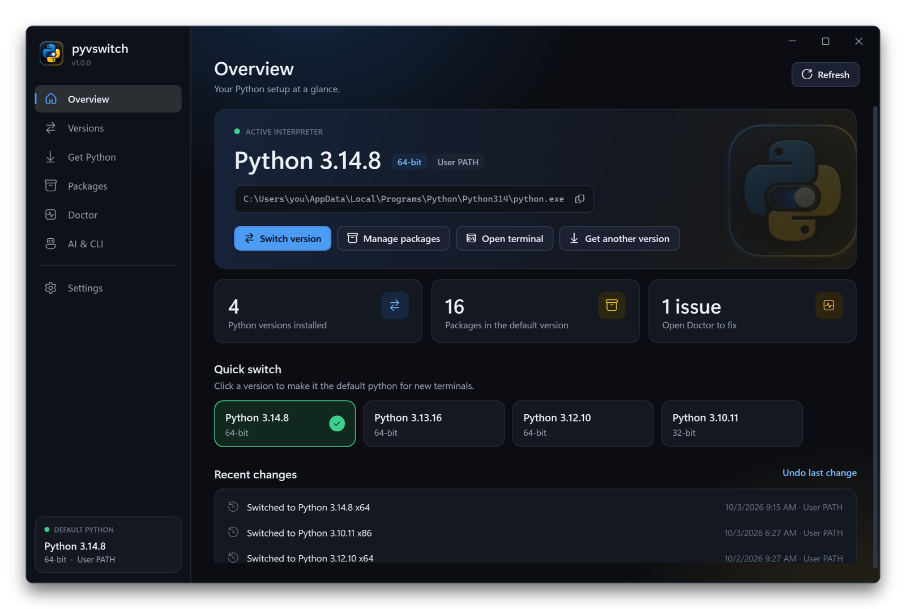
  </picture>
</p>

## What it does

| | |
| --- | --- |
| 🔀 **Switch in one click** | Choose the default `python` from the app, the tray icon or `pyvswitch use 3.12`. Every change saves a backup, and one click rolls it back. |
| ⬇️ **Install any Python** | Browse every release python.org ships a Windows installer for, from the newest 3.x back to 2.x. pyvswitch downloads the official installer, verifies its checksum and installs it silently, with no administrator rights. |
| 📦 **Packages per version** | Pick an interpreter, type a package name, press Install. Look packages up on PyPI, choose a version, check for updates, update everything, import or export `requirements.txt`. |
| 🧪 **Virtual environments** | Create a venv from any installed version and manage its packages the same way. |
| 🩺 **Doctor** | Explains why `python` runs the wrong version (Store aliases, System PATH overrides, dead entries, missing pip) and fixes what it safely can. Shows the exact order Windows searches. |
| 🤖 **AI ready** | A fast native CLI with `--json` on every command, plus an MCP server with 14 tools. One command registers both with Claude, Codex, Cursor, Copilot, Gemini and Windsurf. |
| 🪟 **Feels native** | A modern WPF app with dark and light themes, a tray quick-switcher, and live sync between the app, the CLI and your assistant. |

## Install

1. Download **`pyvswitch-setup-<version>-win-x64.exe`** from the [latest release](https://github.com/keenanlaws/PyVswitch/releases/latest) and run it.
2. Open **pyvswitch** from the Start menu, or open a new terminal and run `pyvswitch`.

The installer puts two programs in `Program Files\ecuunlock.com\pyvswitch` and adds that folder to PATH:

| Program | What it is |
| --- | --- |
| `pyvswitchw.exe` | The desktop and tray app. |
| `pyvswitch.exe` | The command-line tool and MCP server, about 8 MB, compiled to native code so it starts instantly. |

Upgrading from 0.x is automatic: the installer replaces the old version and keeps your settings and PATH history.

> The installer is not code-signed yet, so Windows SmartScreen may ask you to confirm the first run.

## A quick tour

<table>
  <tr>
    <td width="50%">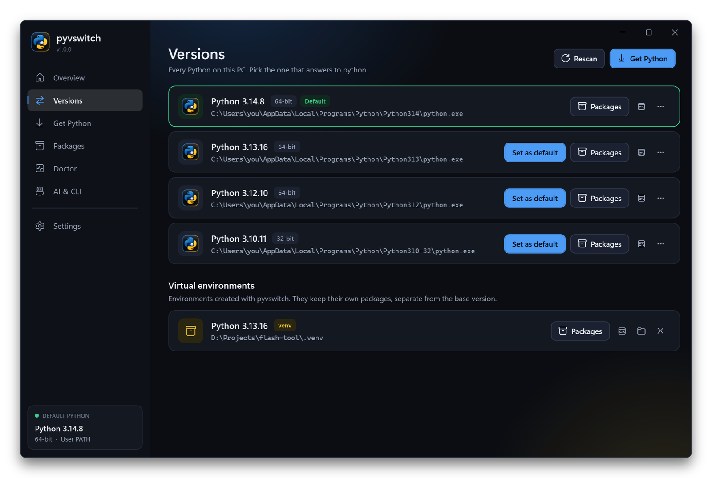<br><sub><b>Versions</b>: everything installed, with one button to make it the default.</sub></td>
    <td width="50%">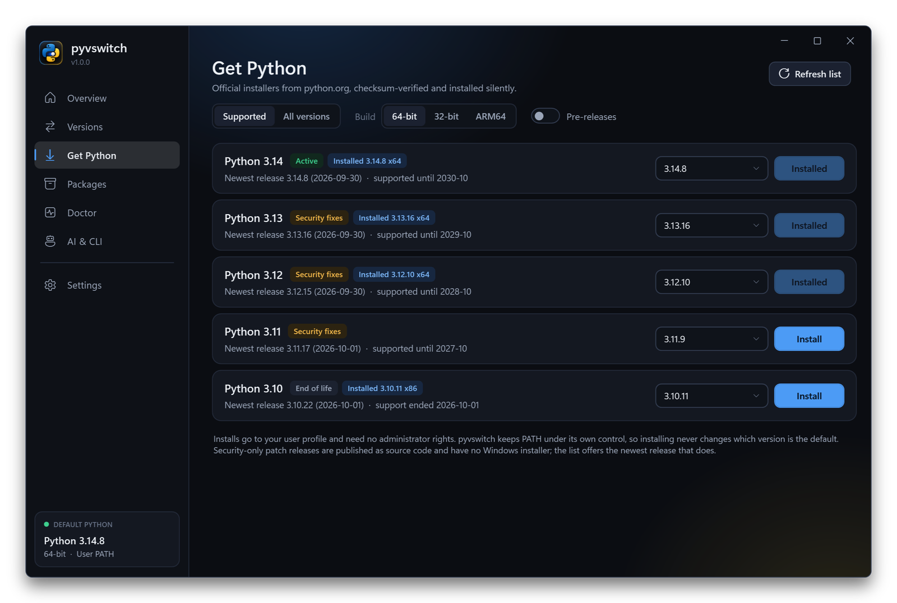<br><sub><b>Get Python</b>: every python.org release, with support status and 64-bit, 32-bit or ARM64 builds.</sub></td>
  </tr>
  <tr>
    <td>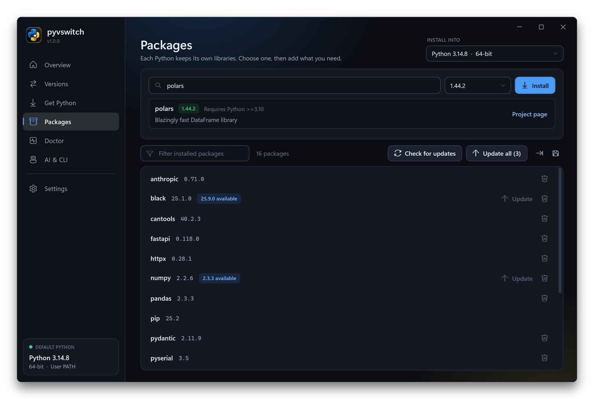<br><sub><b>Packages</b>: look up, install, update and remove libraries for one interpreter.</sub></td>
    <td>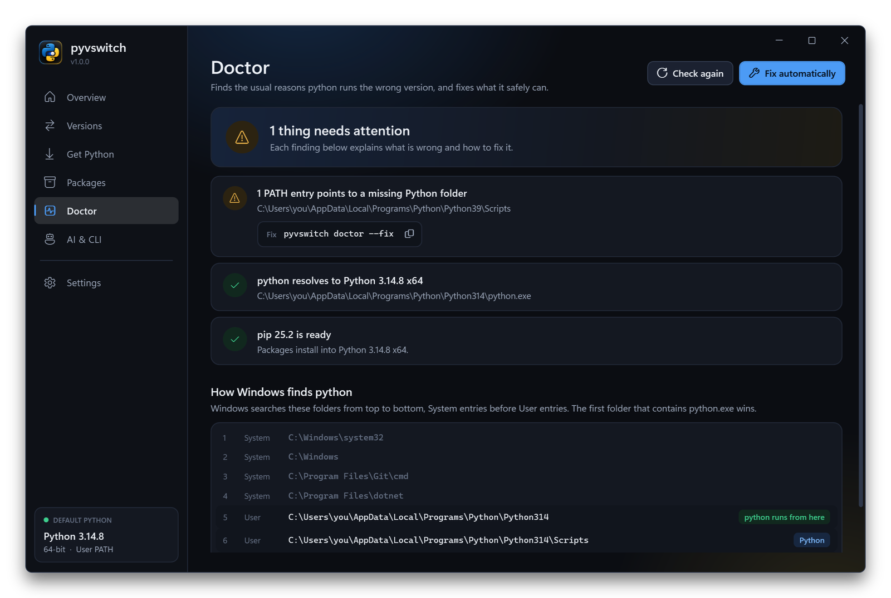<br><sub><b>Doctor</b>: findings with fixes, and the exact order Windows searches PATH.</sub></td>
  </tr>
  <tr>
    <td>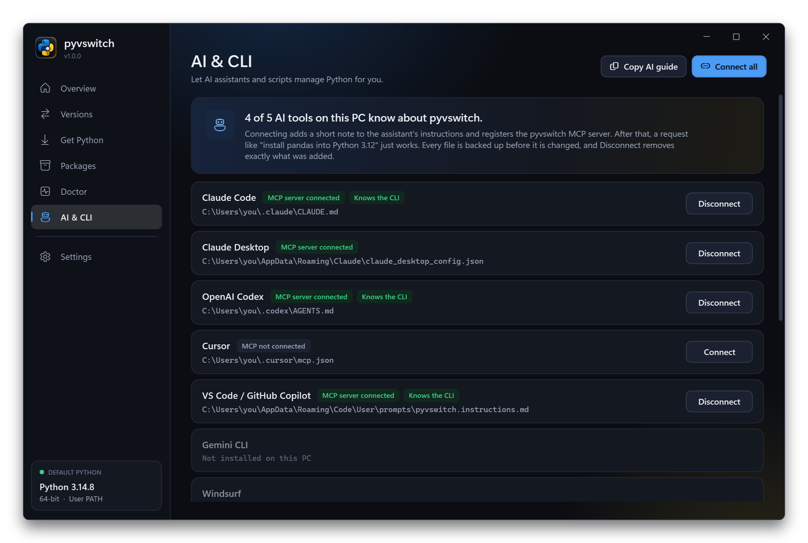<br><sub><b>AI &amp; CLI</b>: connect assistants with one click and copy ready-made commands.</sub></td>
    <td align="center">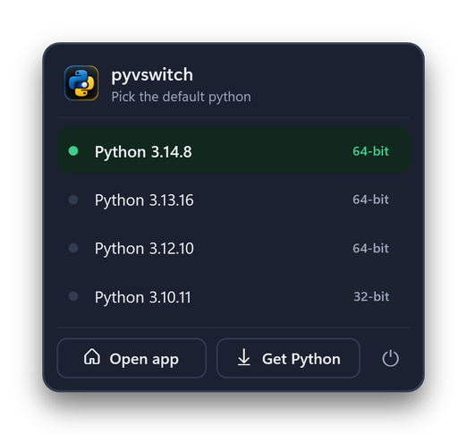<br><sub><b>Tray</b>: switch without opening the app.</sub></td>
  </tr>
</table>

<details>
<summary>Settings and the light theme</summary>
<br>
<p align="center">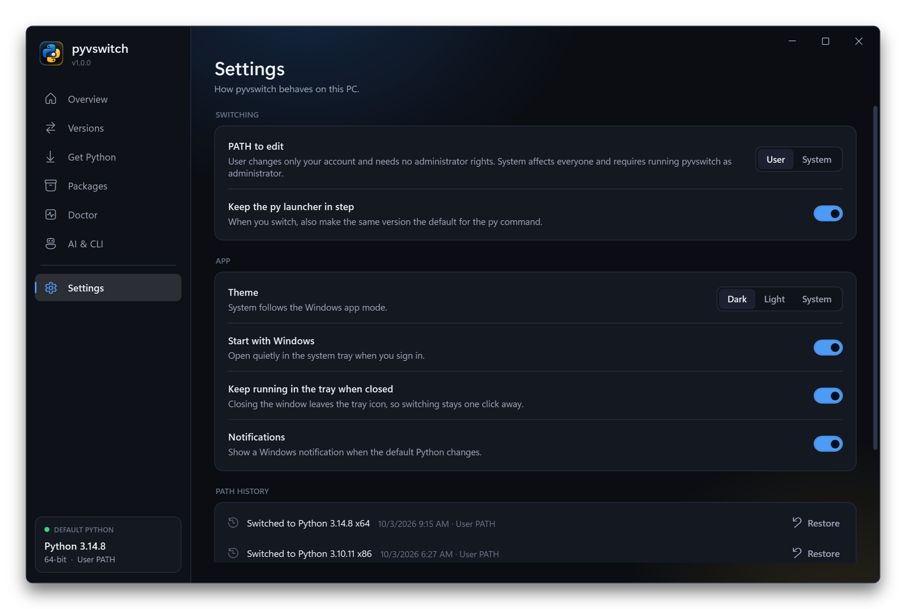</p>
<p align="center">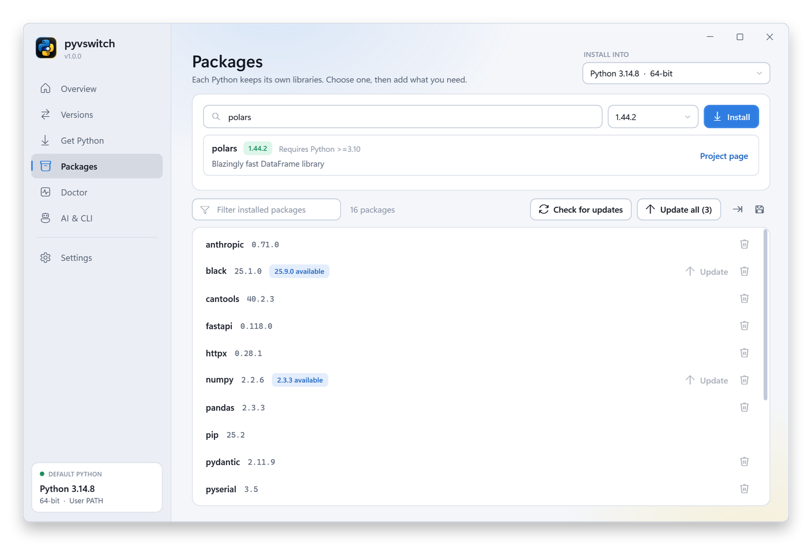</p>
</details>

## How a switch works

<p align="center">
  
</p>

- **Only Python entries are touched.** The folders of the version you pick (and its `Scripts` folder) go first, the folders of other detected interpreters are removed, and every unrelated entry stays exactly where it was.
- **`%VARIABLES%` survive.** PATH is read and written as raw registry data, so entries such as `%USERPROFILE%\bin` are never flattened into literal paths.
- **Always reversible.** Each change stores the previous PATH and `py` launcher default. Roll back from Settings, the Overview page or `pyvswitch rollback`.
- **User scope by default.** No administrator rights are needed. If a System PATH entry overrides your choice, Doctor says so and gives you the fix.
- **New terminals pick it up.** Windows is notified of the change. A shell that is already open keeps its old PATH, which is why `pyvswitch run -p 3.12 -- script.py` exists.

## The command line

<p align="center">
  
</p>

```powershell
pyvswitch list                         # what is installed, and which one is active
pyvswitch use 3.12                     # make 3.12 the default python
pyvswitch available                    # what python.org offers
pyvswitch install 3.13 --use           # download, install and activate the newest 3.13
pyvswitch add requests "numpy<2" -p 3.12   # libraries for one specific version
pyvswitch run -p 3.10-32 -- flash.py   # run a script with a version without switching
pyvswitch doctor                       # why is python not what I expect?
```

<details>
<summary><b>Every command</b></summary>
<br>

| Command | What it does |
| --- | --- |
| `list` | Installed interpreters. `--venvs` adds virtual environments. |
| `current` | The interpreter `python` resolves to. |
| `use <version>` | Make a version the default. `--scope user\|system`, `--no-launcher`. |
| `rollback` | Undo the last PATH change. `--list` shows the history. |
| `which [-p <version>]` | Print the path of an interpreter. |
| `available` | Versions on python.org. `--series 3.12`, `--all`, `--pre`, `--refresh`. |
| `install <version>` | Download and install. `--arch x64\|x86\|arm64`, `--use`, `--all-users`, `--target-dir`. |
| `uninstall <version> --yes` | Remove an installed version. |
| `packages [-p <version>]` | Installed packages. `--outdated`. |
| `add <pkg>... [-p <version>]` | Install packages. `-r requirements.txt`, `--upgrade`. |
| `remove <pkg>... [-p <version>]` | Uninstall packages. |
| `upgrade <pkg>...\|--all [-p <version>]` | Update named packages, or everything outdated. |
| `freeze [-p <version>]` | Export requirements. `-o requirements.txt`. |
| `info <pkg>` | Look a package up on PyPI. |
| `pip [-p <version>] -- <args>` | Run pip directly for one interpreter. |
| `run [-p <version>] -- <args>` | Run a specific Python without switching. |
| `venv <folder> [-p <version>]` | Create a virtual environment. `--list`. |
| `doctor` | Diagnose PATH problems. `--fix` removes dead and duplicate entries. |
| `ai <status\|setup\|remove\|guide>` | Tell AI assistants about pyvswitch. |
| `mcp` | Run the MCP server on stdio. |
| `gui` | Open the desktop app. |

**Selectors.** Anywhere a version is expected you can write `3.12`, `3.12.4`, `3.10-32`, `3.10-64`, a path to `python.exe`, or a venv folder. Leave `-p` out to target the active interpreter.

**Machine-readable output.** Add `--json` to any command. Success is `{"ok": true, "data": ...}`, failure is `{"ok": false, "error": {"code": "...", "message": "..."}}`, and the exit code is non-zero on failure.

Full reference: [docs/CLI.md](docs/CLI.md).
</details>

## Built for AI assistants

<p align="center">
  
</p>

"Install pandas into my 3.12" should not need a paragraph of explanation. pyvswitch gives assistants two ways in, and one command sets both up:

```powershell
pyvswitch ai setup
```

For every supported tool found on the PC, this adds a short note to its global instructions (so it knows the CLI exists and how to call it) and registers the MCP server. Each file is backed up first, the edit is confined to a marked block, and `pyvswitch ai remove` takes out exactly what was added. The same switches are on the **AI & CLI** page of the app.

| Assistant | Instructions file | MCP registration |
| --- | --- | --- |
| Claude Code | `~/.claude/CLAUDE.md` | `claude mcp add --scope user` |
| Claude Desktop | n/a | `claude_desktop_config.json` |
| OpenAI Codex | `~/.codex/AGENTS.md` | `~/.codex/config.toml` |
| Cursor | n/a | `~/.cursor/mcp.json` |
| VS Code / GitHub Copilot | `prompts/pyvswitch.instructions.md` | user `mcp.json` |
| Gemini CLI | `~/.gemini/GEMINI.md` | `~/.gemini/settings.json` |
| Windsurf | `global_rules.md` | `mcp_config.json` |

Anything else can use it too: run `pyvswitch ai guide` and paste the output into the assistant's instructions, or point its MCP configuration at `pyvswitch mcp`.

<details>
<summary><b>MCP tools</b></summary>
<br>

| Tool | Purpose |
| --- | --- |
| `list_pythons` | Installed interpreters and the active one. |
| `get_active_python` | What `python` resolves to. |
| `switch_python` | Make a version the default. |
| `list_available_pythons` | Releases on python.org. |
| `install_python` | Download and install a release. |
| `uninstall_python` | Remove an installed version. |
| `list_packages` | Packages in one interpreter, optionally only outdated ones. |
| `install_packages` | Install packages into one interpreter. |
| `uninstall_packages` | Remove packages from one interpreter. |
| `upgrade_packages` | Update named packages or everything outdated. |
| `package_info` | Look a package up on PyPI. |
| `run_python` | Run a specific interpreter and capture its output. |
| `create_venv` | Create a virtual environment. |
| `doctor` | Diagnose PATH problems. |

Manual configuration for any MCP client:

```json
{
  "mcpServers": {
    "pyvswitch": {
      "command": "C:\\Program Files\\ecuunlock.com\\pyvswitch\\pyvswitch.exe",
      "args": ["mcp"]
    }
  }
}
```
</details>

More detail: [docs/AI.md](docs/AI.md).

## Under the hood

One engine does all the work. The app, the tray, the CLI and the MCP server are thin layers over it, so they always behave the same and stay in sync: switch from your terminal and the tray icon updates.

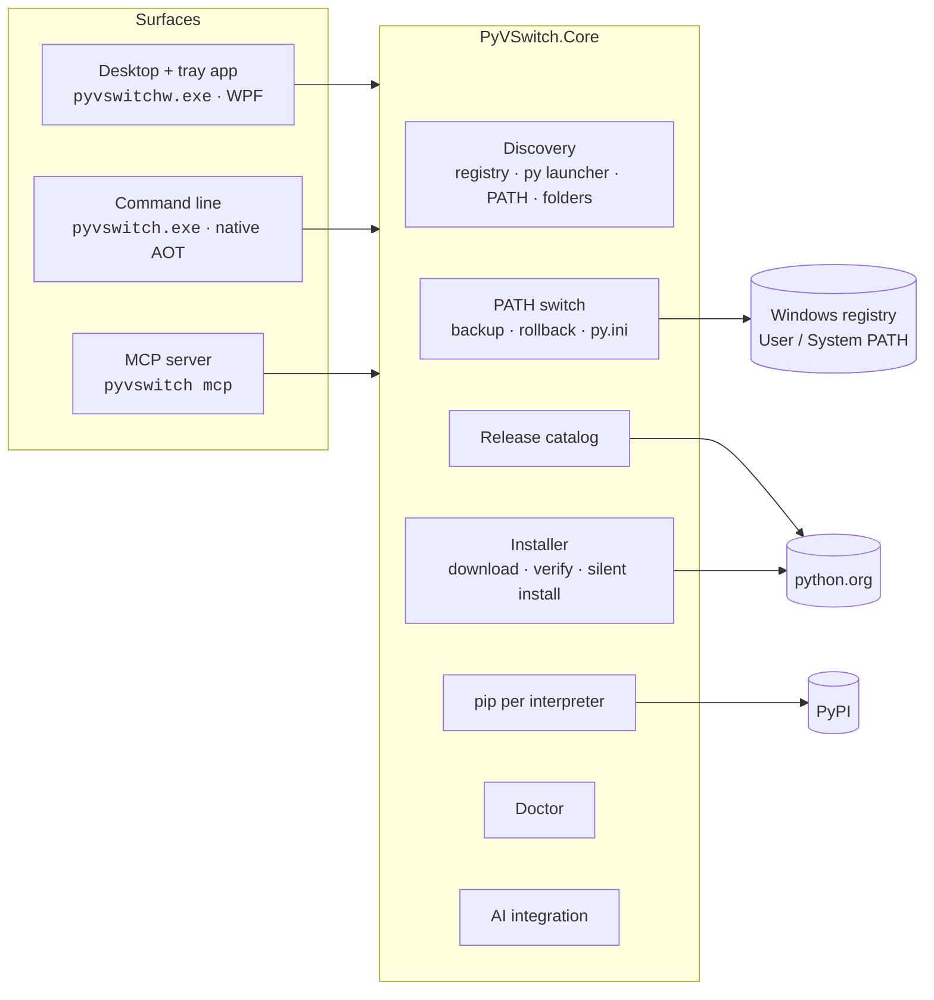

**Where versions come from.** The list of downloadable versions is built from python.org's own release API and cached for 12 hours. Installers are fetched only from `https://www.python.org/ftp/python/` and checked against the size and checksum python.org publishes before they run. Security-only patch releases are published as source code with no Windows installer, so the list offers the newest release in each series that has one.

**How installs behave.** New versions are installed for the current user with the official installer's unattended mode. pyvswitch tells the installer not to touch PATH, because ordering PATH is pyvswitch's job, so installing a version never changes which one is the default unless you ask for it.

**How packages stay separate.** Every package operation runs `python -m pip` with that interpreter's own executable, in an environment cleared of `PYTHONHOME`, `PYTHONPATH` and `VIRTUAL_ENV`, so one version can never install into another by accident.

## Build from source

Requirements: Windows 10 or 11, the [.NET 9 SDK](https://dotnet.microsoft.com/download), and for the native CLI the Visual Studio C++ build tools.

```powershell
git clone https://github.com/keenanlaws/PyVswitch.git
cd PyVswitch

dotnet test                                    # run the unit tests
dotnet run --project src/PyVSwitch.App         # run the desktop app
dotnet run --project src/PyVSwitch.Cli -- list # run the CLI

.\build-installer.ps1                          # build the MSI and setup EXE into artifacts\installer
.\build-installer.ps1 -NoAot                   # same, without needing the C++ build tools
```

```text
src/
  PyVSwitch.Core/   the engine: discovery, PATH switching, catalog, installer, pip, doctor, AI integration
  PyVSwitch.Cli/    pyvswitch.exe: commands, --json output, MCP server
  PyVSwitch.App/    pyvswitchw.exe: WPF app, tray icon, themes
tests/
  PyVSwitch.Tests/  unit tests for the engine
installer/          WiX sources for the MSI and the setup bundle
docs/               CLI and AI guides, README media
```

The screenshots in this README are generated by the app itself, using built-in sample data:

```powershell
pyvswitchw --demo --screenshots .\artifacts\shots          # dark theme
pyvswitchw --demo --light --screenshots .\artifacts\shots  # light theme
```

## Good to know

- **Where settings live.** `%APPDATA%\PythonVersionSwitch` holds `settings.json`, PATH backups, the cached release list and `logs\app.log`.
- **What pyvswitch does not manage.** MSYS2 and Cygwin Pythons, Microsoft Store alias stubs and virtual environments are never offered as the system default, and conda environments are not listed.
- **Legacy versions.** Python 3.5 and newer use the modern python.org installer. Older releases (3.4 and earlier, including 2.7) are installed from their legacy MSI packages; they are long out of support, so expect rough edges.
- **Removing a version** works for Pythons installed by a python.org installer. Others are removed from Windows Settings.
- **Uninstalling pyvswitch** from Windows Settings removes the app and its PATH entry. It leaves your Python installations and the current PATH order as they are.

## Roadmap

- Code-signed installer and a winget package.
- Per-project versions through a `.python-version` file.
- Standalone builds for security-only releases that python.org ships without a Windows installer.
- Elevation on demand for System PATH switches.

## Author

pyvswitch is designed, written and maintained by **Keenan** ([@keenanlaws](https://github.com/keenanlaws)) of [ecuunlock.com](https://ecuunlock.com), who is its sole author.

## License

[MIT](LICENSE) © 2026 Keenan / [ecuunlock.com](https://ecuunlock.com).

pyvswitch is an independent project and is not affiliated with or endorsed by the Python Software Foundation. "Python" is a trademark of the Python Software Foundation.
