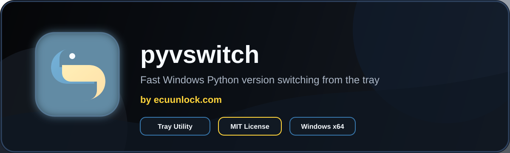

<p align="center">
  
</p>

<p align="center">
  <a href="LICENSE"></a>
  
  
  
</p>

# pyvswitch

**pyvswitch** is a polished Windows tray utility for quickly changing which installed Python version appears first on your PATH. It is built for developers who jump between Python versions and want a fast, visual, rollback-safe switcher without hand-editing environment variables.

Made by **ecuunlock.com**.

## ✨ Highlights

- 🐍 Detects installed Python versions from the registry, `py -0p`, PATH, and cache.
- ⚡ Switches the active Python from a tray popup or full GUI.
- 🧭 Supports User PATH and System PATH scopes.
- 🧯 Creates a PATH backup before every switch.
- ↩️ Restores previous PATH entries with rollback.
- 🪟 Uses a dark Windows-native WPF interface.
- 🎨 Includes Python blue/yellow branding, custom tray popup, and animated UI entrance.
- 📦 Builds a self-contained Windows x64 MSI installer.
- 🧪 Includes health checks for `where python`, `python --version`, and `pip --version`.
- 🚫 Ignores MSYS2 Python executables under `C:\msys64` so they do not hijack normal Windows Python selection.
- 🧹 Includes cleanup/uninstall tools for shortcuts, startup entries, app data, and app folder removal.

## 📸 UI

The app has three main surfaces:

- **Tray icon** for quick access.
- **Tray popup** for fast version switching.
- **Full dashboard** for installs, health checks, settings, rollback, downloads, and cleanup.

## 🚀 Install

Download or build the branded setup app:

```powershell
.\artifacts\installer\pyvswitch-setup-0.4.0-win-x64.exe
```

The MSI is also produced for direct deployment:

```powershell
.\artifacts\installer\pyvswitch-0.4.0-win-x64.msi
```

The installer places the app in:

```text
Program Files\ecuunlock.com\pyvswitch
```

It also creates a Start Menu shortcut named:

```text
pyvswitch
```

## 🧰 Build From Source

Requirements:

- Windows 10/11
- .NET SDK 9.0+

Run the app locally:

```powershell
dotnet run
```

Build a debug binary:

```powershell
dotnet build
```

Publish a self-contained Windows x64 app:

```powershell
dotnet publish .\PythonVersionSwitch.csproj `
  -c Release `
  -r win-x64 `
  --self-contained true `
  -p:PublishSingleFile=true `
  -p:IncludeNativeLibrariesForSelfExtract=true `
  -p:EnableCompressionInSingleFile=true `
  -o .\artifacts\publish\win-x64
```

## 📦 Build The Installer

The repo includes a WiX-based installer script:

```powershell
.\build-installer.ps1
```

Output:

```powershell
.\artifacts\installer\pyvswitch-setup-0.4.0-win-x64.exe
.\artifacts\installer\pyvswitch-0.4.0-win-x64.msi
```

The build script:

- Restores the local WiX tool.
- Publishes a self-contained app.
- Builds the MSI.
- Builds a branded setup EXE wrapper with the pyvswitch icon.
- Validates the MSI.

## 🧠 How Switching Works

pyvswitch updates PATH by placing the selected Python install directory, and its `Scripts` directory when present, before other Python entries.

Before each switch, pyvswitch stores a backup so you can roll back safely.

Default behavior:

```text
Scope: User PATH
Backup: enabled
Rollback: enabled
Python launcher py.ini update: enabled
```

System PATH changes require administrator permissions.

## 🩺 Health Check

The Health tab runs:

```powershell
where python
python --version
pip --version
```

Commands are timeout-protected so they should not freeze the UI.

## 🧾 Logs

If the app reports a switch failure or recovers from a UI error, check:

```powershell
$env:APPDATA\PythonVersionSwitch\logs\app.log
```

## 🧹 Cleanup

The Uninstall tab can:

- Remove the startup entry.
- Remove the desktop shortcut.
- Delete saved app settings and backups.
- Launch a self-cleanup script for the installed app folder.

It does **not** uninstall Python versions or edit PATH during cleanup.

## 🗺️ Roadmap

- 🧑‍💻 `pyvswitch-cli` for headless scripting and automation.
- 🧩 Optional per-project Python profiles.
- 🔍 Better package-manager detection.
- 🪄 One-click install flows for official Python releases.
- 📊 More detailed PATH diff preview before switching.

## 📄 License

Licensed under the [MIT License](LICENSE).
